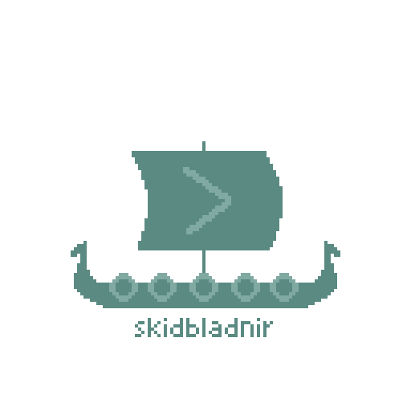

  

A minimal Unix-style shell written in [Odin](https://odin-lang.org/), built as a
project to learn the language and, maybe, to end up genuinely useful day to day.
Given my love for Norse mithology and viking themes, the name comes from Skíðblaðnir, the ship in Norse myth that folds up small enough to carry in a pocket. Fitting for a compact shell.

### Features
- Runs external programs and a set of built-in commands.
- A hand-written lexer that tokenizes input
- **Pipelines** of any length: `cat file | grep foo | wc -l`.
- **Redirection**: `>`, `>>` (append), and `<` (input), including combinations
  like `grep TODO < in.txt > out.txt`.
- An interactive **line editor** built on raw terminal mode:
  - character echo and mid-line editing
  - backspace
  - command **history** (up/down arrows)
  - navigation in the input (left/right arrows)
- Tilde and environment variable expansion
- TAB completion, working for builtins and partially for path

### Built-in commands

| Command | Description |
| --- | --- |
| `cd <dir>` | Change the current working directory |
| `pwd` | Print the current working directory |
| `munin` | Print the session command history |
| `munin <n>` | Re-run the command at history index `n` |
| `huginn <path> <needle>` | Search recursively into the path selected for the typed string |
| `edda` | List all built-in commands and their descriptions |
| `exit` | Exit the shell |
| `...` | More to come... |

### Running

You can find a comfy build of skidbladnir in the folder [build](https://github.com/Bayslak/skidbladnir/tree/main/build).  
Once downloaded and ported to your linux machine, to run it you just need to launch:
`./skidbladnir`

### Platform note

skidbladnir targets Linux (including WSL).   
The line editor uses POSIX terminal
control (`termios`), which is Unix-only, so build and run it from a Linux
environment. On Windows, use WSL.